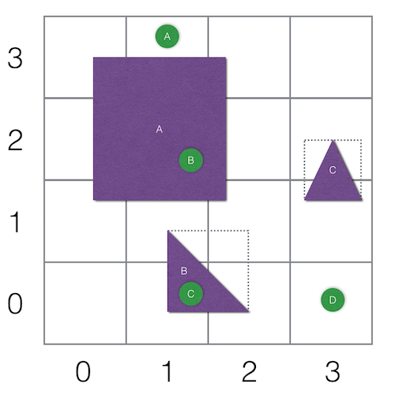
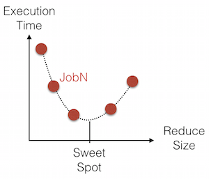
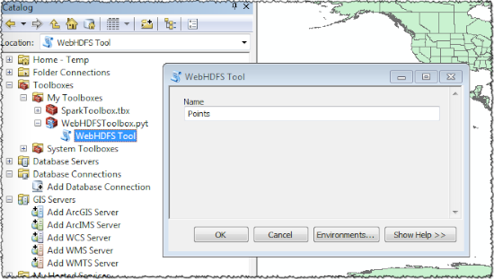
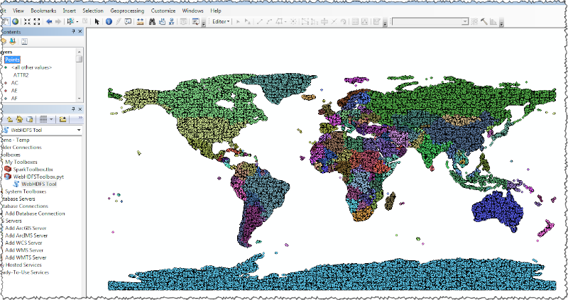

# Spark Point In Polygon

[Spark](http://spark.apache.org/) job to perform massive feature Point in Polygon (PiP) operations on a distributed share-nothing cluster.

In this job context, a feature is defined to have a geometry and a set of attributes. The geometry can be
a point, a polygon or a multi-polygon, and an attribute is a string encoded value. 

The job takes 2 inputs, a path to a set of files containing point features and a path to a set of files containing polygon features.
The job iterates through every point feature and identifies which polygon it is inside of and then emits a union of user-defined
attributes from the point feature and the polygon feature. 
 
In this current implementation, each point feature is read from a field delimited text file where the x and y coordinates are double-typed fields.
And each polygon feature is also read from a field delimited text file where the coordinates are defined in a [WKT](https://en.wikipedia.org/wiki/Well-known_text) format.

Here is a point feature sample:

```
111.509,80.9801,7.07783,R14
```

And here is polygon feature sample:

```
0|EC02|ECU-AZU|Azuay|EC|ECU|Ecuador|555881|Province|Provincia|8788.83|3393.37|1|0|MULTIPOLYGON (((-79.373981904060528 -3.3344269140348786, ...
```

Note that in the above sample, the point fields are separated by a comma, where the polygon fields are separated by a pipe `|`.
The delimited characters can be defined at execution time.

__Update: Nov 4, 2016__

- JDK 8 is a requirement.
- Updated the map phase where, rather than sending to the reducer the whole geometry for each grid cell key, now the _clipped_ geometry for a cell is sent to the reducer phase.  This reduced the memory consumption and network bandwidth to transfer larger geometries.
- Updated Docker content to Spark 1.6.2 and JDK 8 to accommodate the clip function in `org.geotools:gt-main:15.2`.

## Building the Project

The build process uses [Maven](https://maven.apache.org/)

```shell
mvn package
```

This will create a Spark jar in the `target` folder, and any runtime jar dependencies, will be copied to the `target/libs` folder.

## Configuring the job

The job can accept a command line argument that is a file in a [properties format](http://docs.oracle.com/cd/E23095_01/Platform.93/ATGProgGuide/html/s0204propertiesfileformat01.html).
If no argument is found, then it tries to load a file named `applications.properties` from the current directory.

Key|Description|Default Value
---|-----------|-------------
geometry.precision | The geometry factory precision | 1000000.0
extent.xmin | minimum horizontal bounding box filter | -180.0
extent.xmax | maximum horizontal bounding box filter | 180.0
extent.ymin | minimum vertical bounding box filter | -90.0
extent.ymax | maximum vertical bounding box filter | 90.0
points.path | path of point features | must be defined
points.sep | the points field character separator | tab
points.x | the index of the horizontal point coordinate | 0
points.y | the index of the vertical point coordinate | 1
points.fields | comma separated list of field value indexes to emit | empty
polygons.path | path of polygon features | must be defined
polygons.sep | the polygons field character separator | tab
polygons.wky | the index of the WKT field | 0
output.path | path where to write the emitted fields | must be defined
output.sep | the output fields character separator | tab
reduce.size | the grid size of the spatial join (see below for details) | 1.0

The file can also include [Spark configuration properties](http://spark.apache.org/docs/latest/configuration.html)
 
## Implementation details
 
Because the data can be massive, it cannot fit in memory all at once to perform the PiP operation and to, for example, create
a spatial index of all the polygons for quick lookup. So...you will have to segment the input data and operate on 
each segment individually.  And since these segments share nothing, they can be processed in parallel.
So, in the geospatial domain, segmentation takes the form of subdividing the area of interest into smaller rectangular areas.
Rectangles are "nice" because of their straight edges. You can, for example, quickly find out if a point is inside or outside of it,
and complex shapes can be subdivided into coarse edge matching rectangles. It is that last fact that we will use to segment the input
points and polygons in such that that we can perform a massive PiP per segment.

Take for example the below points and polygons in an area of interest.



Feature Polygon A can be segmented into (0,1) (0,2) (0,3) (1,1) (1,2) (1,3) (2,1) (2,2) (2,3).

Feature Polygon B can be segmented into (1,0) (1,1) (2,0) (2,1) because of its _bounding box_.
 
Feature Polygon C can be segmented into (3,1) (3,2).

Feature Point A can be segmented into (1,3).

Feature Point B can be segmented into (1,2).

Feature Point C can be segmented into (1,0).

Feature Point D can be segmented into (3,0).

The features are now encapsulated by their segments and are operated on in parallel.
  
Segment (1,2) has Polygon A and Point B. And since Point B is inside Polygon A then, the selected attributed of Point B and the selected attributes of Polygon A will be written to the output file.

In the case of Segment (1,3), it contains Polygon A and Point A. However, because Point A is _not_ inside Polygon A, then nothing is written out.

In this implementation, the rectangle is actually square, and the size of the square (the segmentation area) is defined by the `reduce.size` properties.
This value is very data specific and you might have to run the job a multiple times with different values while tracking the execution time to determine the "sweet spot".



## Running the job

It is assumed that Spark was [downloaded](http://spark.apache.org/downloads.html) and installed in a folder that is hereon referred to as `${SPARK_HOME}`

Unzip `data/points.tsv.zip` and `data/world.tsv.zip` into the `/tmp` folder.

`points.tsv` is a 1,000,000 randomly generated points and `world.tsv` contains the world administrative polygons.

## Run In Local Mode

```
${SPARK_HOME}/bin/spark-submit\
 target/spark-pip-0.3.jar\
 local.properties
```

The output can be viewed using:

```
more /tmp/output/part-*
```

## Run on a Hadoop Cluster

For testing purposes, a Hadoop pseudo cluster can be created using [Docker](https://www.docker.com/) with HDFS, YARN and Spark.
Check out [README.md](docker/README.md) in the `docker` folder.

Let `${SPARK_PIP}` be the folder where you cloned the `spark-pip` project.

```
docker run\
  -it\
  --rm=true\
  --volume=${SPARK_PIP}:/spark-pip\
  -h boot2docker\
  -p 8088:8088\
  -p 9000:9000\
  -p 50010:50010\
  -p 50070:50070\
  -p 50075:50075\
  mraad/hdfs\
  /etc/bootstrap.sh
```

Put the supporting data in HDFS:

```
unzip -p /spark-pip/data/world.tsv.zip | hdfs dfs -put - /world/world.tsv
unzip -p /spark-pip/data/points.tsv.zip | hdfs dfs -put - /points/points.tsv
```

The following reads by default the application properties from the file `application.properties` in the current folder if no file argument is passed along. 

```
cd /spark-pip
hdfs dfs -rm -r -skipTrash /output
time spark-submit\
 --master yarn-client\
 --driver-memory 512m\
 --num-executors 2\
 --executor-cores 1\
 --executor-memory 2g\
 target/spark-pip-0.3.jar
```

## View Data in HDFS

The output of the previous job resides in HDFS as CSV text files in `hdfs://boot2docker:9000/output/part-*`.
This form of output from a BigData job is what I term *GIS Data* and needs to be visualized.
The HDFS configuration in the docker container has the [WebHDFS](https://hadoop.apache.org/docs/r1.0.4/webhdfs.html) REST API enabled.

```xml
<property>
    <name>dfs.webhdfs.enabled</name>
    <value>true</value>
</property>
```

The `PiPToolbox` ArcPy toolbox contains `Load Points` as a tool to open and read the content of CSV files in HDFS and
converts each row into a feature in an in-memory feature class.




